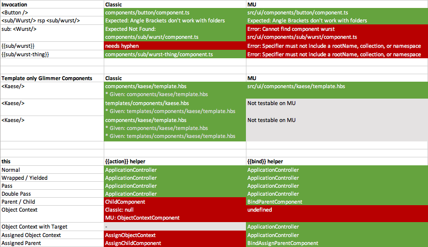

# Sparkles Test Repo

This repo is created to test sparkles component use-cases. This is to get experience on how to use sparkles (as a PoC implementation for glimmer components) today in classic ember apps and how this will work in the future MU layout apps (and how they will be structured). The idea is to retrieve best practices that you can apply today and will continue to work with MU layout. Three different use-cases with various variations have been tested

1. Invocation
2. Template only Glimmer Components
3. `{{action}}` helper and the scope of `this`

These tests are run against a classic ember app and an ember MU app.

## Overview of the Results

Some of these "tests" are red and are expected to be red. Some tests are red and were probably run under with wrong expectations. The question is whether these tests are bugs or whether the expectations are wrong.



A note on reading this:

* For Invocation and Template only Glimmer Components the results show the found template, not found - but expected - template
* For `this` the sheet shows the value of what `this` is. It is expected to always be `ApplicationController` (see below)

## Invocation

Invocation was probably the most easiest one to test. Some things that confuse me:

* Invocation of (folder-)curly-brace components throwed an error in MU
* Angle bracket component couldn't be resolved by its name that resides in a sub folder (= `<Wurst />`)

## Template Only Glimmer Components

Everything went well so far. Keep in mind, for classic apps there is a priority order in which template only components - if they happen to exist in two locations - are resolved.

## Scope of `this` when using `{{action}}` helper

Glimmer stops making use of embers `@action` hash. Actions aren't referenced by their name anymore, instead the method is passed down directly. Important part is, that they are run under the scope they are defined. That is being tested with this `ApplicationController` class:

```js
import Controller from '@ember/controller';

export default class ApplicationController extends Controller {

  whoAmI() {
    console.log('whoami', this);
  }
}
```

This "action" is passed down as `{{action this.whoAmI}}` to all variations it is tested in. My expectation is that `this` should always be `ApplicationController`. In the past, I realised this wasn't always the case so I constructed plenty use-case variations to see which violate my expectations. The idea is from an application route/controller I can only pass my action method and whatever happens afterwards is out-of-control in the scope of the application route/controller. Whenever my action method is invoked from inside the components it is passed to, I want to rely on `this` being my `ApplicationController` anyway some weird/bad things happen on the way forth and back and whatever I put in is not what's returned (PS: There is a computer science term describing this immutability and reliability - but I'm just a sport scientist ¯\\_(ツ)_/¯).

According to @rwjblue the `{{action}}` helper is probably not the way to go when running into a glimmer components world. The best option is the `{{bind}}` helper from [ember-bind-helper](https://github.com/Serabe/ember-bind-helper). Tests include the use of bind helper in contrast to the action helper.